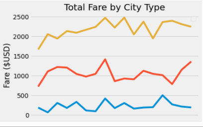

# PyBer_Analysis
This project was done as an analysis of the ride-sharing company Pyber. The company desired to have a visual representation of the total weekly fares for each city type (rural, suburban and urban) and how they differ from eachother week over week. In order to accomplish this data had to be merged from two different data sets before being presented in a line chart format.

# Results

We can see how in the above image of the finalized chart how the data for the three city types vary week over week with the urban fares (in yellow) starting at nearly double the fares of the next line, the suburban line (in red), which is itself almost double that of the final line of the rural fares (in blue). Over the weeks in which this data was plotted it seems as if there is some measure of a correlation in the data between the urban and suburban with both of them tending to generally rise and fall with the other whereas the rural data appears to be more separate and generally more stable.

# Summary

While on the surface it may seem as if Pyber would be wise to focus their efforts on increasing the rural weeklys fares, due to them being well less than the other two city types it is my belief that this course of action would be unwise and their time and money would be better focused on the urban and suburban demographics. While the rural data shows that much less money is made in these regions it is likely due to there simply being a smaller population of people in these areas and less of a need for a ride sharing application due to a variety of factors including less traffic, greater percentage of the population owning their own automobiles as well as likely greater wait times due to the geographic distance between destinations. Pyber should instead focus on combating the volatility in the urban and suburban spheres through analysis of the down weeks, attempting to pinpoint causations that might lead to lesser overall fares so as to combat them, as well as increased marketing to spread awareness of the service amongst the people. Pyber could also attempt to implement a service that would drop the price of the service during times when it seems as if demand might be decreasing to incentivize people to use the service more during these times.
